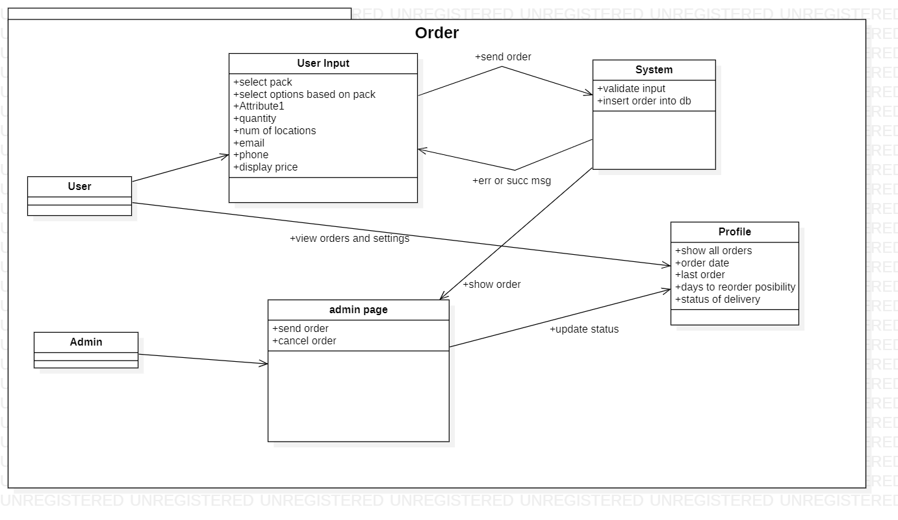

# BioPak Packagin Solutions - Supplier Website

**Website for a made-up supplier of bio-degradable packaging solutions. Company founded in 1991 that seeks to 
move a part of the ordering system online.
It needs a site which will serve as a marketing media for acquiring new clients and
for establishing good customer relations with existing clients**
  
## Description  

BioPak is a made-up company which supplies bio-degradable packaging in an attempt to aid the implementation of circular economy 
into other companies, mainly in the food industry. This website is supposed to serve as a marketing tools to attract new business 
opportunities as well as to provide an ordering point for existing (and new) clients.  The idea is to avoid client uncertainty 
during phone calls and once BioPak contacts the client the order has already been placed and only details are left to be arranged. 
The website is exclusive, meaning that only the selected clients can use the functionality and place orders.  

This project uses PHP 7.3.  

Admin Login Info:  
Email : aa@aa.com  
Password: Admin1234  

  
  
## Limitations:
- Login – Maximum number of log in attempts can be added
- Contact form – Captcha should be added to avoid spam messages
-	Marketing – further front-end JavaScript development
-	Admin page –  Adding admins through admin page
  
## Marketing
-	Index page – Provides a basic overview of the company’s activities
-	About – Shows mission, vision and story of the company
-	Products – Contains subpages showing the 3 different material options offered (paper, plastic, aluminum)
-	Solutions – Displays further delivery details and measures which are important for the ordering
-	Pricing – Here the different packages are displayed and a button that leads to the order page

## Landing Page
Clients are supposed to land on the solutions page. On this page, the main conversion should occur. 
It is where the main ideas and advantages are presented. The client can see the measures 
and the delivery-related information.  

## User Accounts: 

**Register -->**  Client company requests a registration by filling the form on the sign up page. 
The form is then submitted and an approval from the administrator is pending. 
The client may try to log in and will receive an error message showing that the account has not been verified yet.  

**Verification -->** The admin has the ability to accept or reject account requests. 
This is done through the admin page which only admins can see.   

**Login -->** Once (if) the account has been verified, the user can log in. 
Client can do so by using his/her email and password. Error messages are shown in case of a failed log in attempt.  
If the email is successful, the user is takes to the index page with a new option to view user account.  

  

## Ordering:  
Users can place orders from the orders page which is accessed through the pricing page.
This is so that a client views all the options before making a decision.   

**Pricing -->** Clicking on the order button on either of the packages, he/she is directed to the order page. 

**Order -->** Users here , can select the desired package along with the number of delivery locations and quantity. 
Users also provide a phone and email. 
This is asked again, even though this information was asked during registration, 
as some companies might want another manager to handle the delivery.
Errors are shown clearly to the user in case something went wrong. 
Otherwise, a success message is shown.

**Profile -->** Once an order has been places, users can go to their profile on which they can see the 
status of the order as well as how  many days has passed from the order and how many 
days are left before a reorder can be clicked.   

  
  
  

## Profile:
Here the users can view their orders and change their details. The main funcitonality is displayed in the diagram below.
Most important parts are: 
- logout button, which allows the users to sign out of their account 
- order system, which allows for order status checking as well as to easily reorder
- settings, which allows users to change their emial or password  
  
   

  
  
  
## Database:  
- Companies --> It is made up of 3 tables. Main "users".  

- Packs --> is the second. it hold all the information related to the packs offered.  

- Orders --> Connected to the previous 2 tables through foreign keys, 
on update and delete are set to cascade  

  
